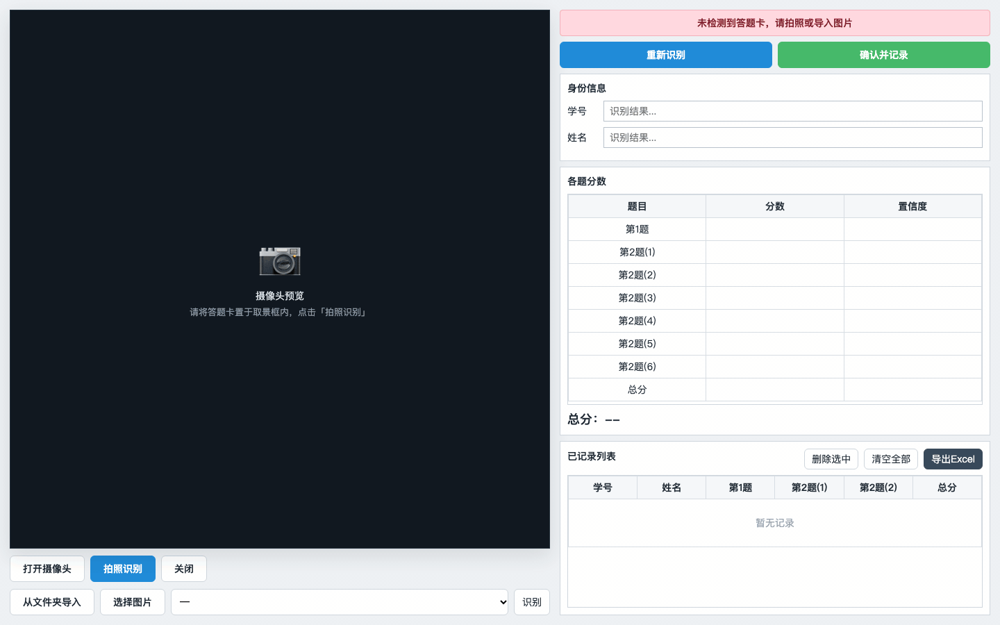

<div align="center">

# 📝 answer-sheet-ocr

**答题卡姓名、学号与分数智能识别系统**
<br/>
*An end-to-end OCR system that reads student names, IDs and scores from handwritten answer sheets.*

[](LICENSE)
[](https://www.python.org/)
[](https://onnxruntime.ai/)
[](https://www.ultralytics.com/)
[](https://flask.palletsprojects.com/)

</div>

<p align="center">
  
  <br/>
  <em>完整流程演示：拍照 → 识别 → 人工核对 → 确认记录 → 导出 Excel</em>
</p>

---

## 🌏 Overview

`answer-sheet-ocr` 是一个面向**手写答题卡**的端到端识别系统：先通过 **YOLO 检测模型** 精确定位姓名、学号、各小题分数与总分等字段区域（ROI），再将每个 ROI 送入对应的识别模型——**中文 OCR** 识别姓名、**CNN 数字识别模型** 识别学号与分数——最后在 Web 界面上完成人工核对、确认与 Excel 导出。

整个推理链路已导出为 **ONNX**，仅依赖 `onnxruntime` + `numpy` + `opencv` 即可在 CPU 上运行，无需 GPU，也无需安装完整的 PyTorch 训练环境。

> *answer-sheet-ocr is a complete pipeline for handwritten answer-sheet recognition. A YOLO detector first localizes field regions (name, student ID, per-question scores, total), then each ROI is routed to the right recognizer — a Chinese OCR engine for the name field and lightweight CNN digit recognizers for the ID and score fields. The whole inference graph runs on CPU via ONNX Runtime.*

### ✨ 特性

- 🎯 **两阶段「检测 + 识别」架构**：YOLO 定位 ROI → 分字段路由到专用识别器，各环节解耦、可独立替换。
- ⚡ **纯 CPU 推理**：全部模型导出为 ONNX，克隆即可跑，无需 GPU 与 PyTorch 运行时。
- 🧩 **分字段专用模型**：学号、各小题分数、总分使用独立微调的 CNN 数字识别模型，字级准确率最高 96.2%。
- 🇨🇳 **中文姓名识别**：内置精简版 `chineseocr_lite` 运行组件，支持中文姓名字段识别。
- 🖥 **开箱即用的 Web 前端**：摄像头采集、图片/文件夹导入、重新识别、人工核对修改、确认记录、导出 Excel。
- 🔌 **轻量 REST API**：`POST /api/recognize` 单图识别、`POST /api/export` 导出成绩表。
- 🧪 **完整训练与评估工具链**：从 LabelImg 标注 → YOLO 数据集 → 检测/数字模型训练 → ONNX 导出 → 指标评估，全流程脚本。
- 🔒 **隐私友好**：仓库不包含任何真实答题卡图片、真实姓名或学号明细。

---

## 🧠 工作原理

```
                    ┌──────────────────────────────────────────────────┐
                    │                 输入：答题卡图片                     │
                    └──────────────────────────┬───────────────────────┘
                                               │
                    ┌──────────────────────────▼───────────────────────┐
                    │  ① YOLO 字段检测（best.onnx，imgsz=1280）          │
                    │     定位 name / student_id / score_* / total 的 ROI │
                    └──────────────────────────┬───────────────────────┘
                                               │ 按字段裁剪 ROI（自适应 padding）
                 ┌─────────────────────────────┼─────────────────────────────┐
                 │                             │                             │
        ┌────────▼────────┐          ┌─────────▼──────────┐        ┌─────────▼──────────┐
        │   姓名字段        │          │     学号字段         │        │    分数字段          │
        │  chineseocr_lite │          │  student CNN       │        │   score CNN         │
        │  (CRNN + DBNet)  │          │  10 位定长切分      │        │  数值 ROI 识别       │
        └────────┬────────┘          └─────────┬──────────┘        └─────────┬──────────┘
                 │                             │                             │
                 └─────────────────────────────┼─────────────────────────────┘
                                               │
                    ┌──────────────────────────▼───────────────────────┐
                    │  ② 人工核对 → ③ 确认记录 → ④ 导出 Excel            │
                    └──────────────────────────────────────────────────┘
```

**设计要点**

1. **ROI 检测先行**：将「在哪识别」与「识别什么」彻底分离。检测器只需回答「字段框在哪」，识别器只需回答「框里是什么」，两者可独立迭代。
2. **分字段专用识别器**：姓名（中文 OCR）、学号（定长 10 位数字）、分数（数值）是三种差异巨大的识别任务，分别用最合适的模型，而非一个通用模型硬扛。
3. **定长切分 + CNN 分类**：学号按 10 位定长切分为单字符图，逐位送入 CNN 分类，天然适配固定位数的考号。
4. **全 ONNX 部署**：训练产出 `.pt`，交付统一导出 `.onnx`，用 `onnxruntime` 单依赖运行，跨平台、可嵌入。

---

## 📊 性能指标

> 以下指标基于本项目自带数据集（142 张答题卡，70 train / 72 val，共 1412 个字段框）。评估脚本见 [`scripts/evaluate_yolo.py`](scripts/evaluate_yolo.py) 与 [`scripts/joint_extract.py`](scripts/joint_extract.py)。**请如实参考，本仓库不含数据，可复现评估流程但无法复现精确数字。**

### ① ROI 检测（YOLO）

| 指标 | 值 |
| --- | --- |
| 字段召回率（IoU@0.5） | **100.0%** |
| 平均 IoU | **0.889** |
| 平均检测置信度 | 0.891 |

### ② 数字识别 CNN

| 模型 | 最佳验证准确率 |
| --- | --- |
| 分数字识别 `roi_score_digit_cnn` | **94.4%**（80 epochs） |

### ③ 端到端字符级准确率（val 集）

| 字段 | 字符级准确率 | 说明 |
| --- | --- | --- |
| 第2题(5) | **96.2%** | 分数 |
| 第2题(2) | 87.1% | 分数 |
| 第2题(4) | 82.7% | 分数 |
| 第2题(1) / 第2题(3) | 78.4% | 分数 |
| 第1题 | 59.9% | 分数 |
| 第2题(6) | 59.5% | 分数 |
| 学号 | 56.6% | 定长切分 + CNN |
| 总分 | 23.2% | ⚠️ 见下方已知限制 |
| 姓名 | 0.0% | ⚠️ 中文 OCR 未打通（见已知限制） |

---

## 🚀 快速开始

### 环境要求

- Python **3.10+**
- 无需 GPU，无需安装 PyTorch

### 1. 安装依赖

```bash
git clone https://github.com/Nothings2Seeyeyeye/answer-sheet-ocr.git
cd answer-sheet-ocr

# 推荐使用独立虚拟环境
python -m venv .venv && source .venv/bin/activate   # Windows: .venv\Scripts\activate
pip install -r requirements.txt
```

> 依赖已按「推理最小集」裁剪：`flask`、`openpyxl`、`pillow`、`numpy`、`opencv-python-headless`、`onnxruntime`、`pyclipper`、`shapely`。

### 2. 单图推理（命令行）

```bash
python scripts/infer_single.py --image /path/to/answer_sheet.jpg --output prediction.json
```

输出 JSON 包含学号、姓名、各题分数、检测框与置信度：

```json
{
  "student_id": "2021162992",
  "name": "",
  "scores": [
    {"field": "score_1", "label": "第1题", "value": "12", "confidence": 0.99},
    {"field": "total",  "label": "总分",  "value": "98", "confidence": 0.97}
  ],
  "detections": [{"field": "name", "confidence": 0.87, "box": [682, 325, 847, 411]}]
}
```

### 3. 启动 Web 前端

Linux / macOS：

```bash
bash run_frontend.sh
```

Windows：

```bat
run_frontend.bat
```

浏览器打开 <http://127.0.0.1:7860>，即可摄像头拍照 / 导入图片 → 自动识别 → 人工核对 → 确认记录 → 导出 Excel。

---

## 🔌 REST API

### `POST /api/recognize`

上传单张图片，返回识别结果（`multipart/form-data`，字段名 `image`）。

```bash
curl -F "image=@answer_sheet.jpg" http://127.0.0.1:7860/api/recognize
```

### `POST /api/export`

将前端确认的记录导出为 Excel（`application/json`，字段名 `records`）。

```bash
curl -X POST http://127.0.0.1:7860/api/export \
  -H "Content-Type: application/json" \
  -d '{"records":[{"student_id":"2021162992","name":"张三","scores":[{"field":"total","label":"总分","value":"98"}]}]}'
```

返回 `.xlsx` 文件，第一行为字段名，其后为确认记录。

---

## 📁 目录结构

```text
answer-sheet-ocr/
├── app.py                          # Flask Web 服务（前端后端 + REST API）
├── run_frontend.sh / .bat          # 一键启动前端
├── requirements.txt                # 推理最小依赖
├── LICENSE
├── README.md
├── scripts/
│   ├── infer_single.py             # 单图推理（检测 + 分字段识别）
│   ├── onnx_digit.py               # ONNX 数字识别器（切分 + CNN 分类）
│   ├── train_yolo.py               # YOLO 检测模型训练
│   ├── train_roi_digit_model.py    # ROI 数字模型微调
│   ├── mnist_roi_digits.py         # 从标注框提取数字样本
│   ├── prepare_yolo_dataset.py     # LabelImg 标注 → YOLO 数据集
│   ├── field_dataset.py            # 字段数据集构建
│   ├── evaluate_yolo.py            # 检测指标评估
│   ├── joint_extract.py            # 端到端联合识别与评估
│   ├── export_onnx_models.py       # .pt → .onnx 导出
│   └── package_results.py          # 结果打包
├── weights/
│   └── field_yolo/best.onnx        # YOLO 字段检测模型（ONNX）
├── models/
│   ├── roi_score_digit_cnn/        # 分数字识别模型（ONNX + 训练 manifest）
│   └── roi_student_digit_cnn/      # 学号数字识别模型（ONNX + 训练 manifest）
├── third_party/
│   └── chineseocr_lite/            # 精简中文 OCR 运行组件（GPL-2.0）
├── data/
│   └── field_yolo*/                # 类别定义 data.yaml + YOLO 标注（无图片）
├── metrics/                        # 聚合指标摘要（不含个人数据）
├── static/                         # 前端 JS / CSS
└── templates/                      # 前端 HTML
```

---

## 🏋️ 训练复现

仓库不包含隐私数据。如需从头复现训练，请准备 LabelImg 标注的答题卡数据集：

```text
labelimg_dataset/
  images/      # 答题卡图片
  labels/      # 对应 YOLO 标注（字段框）
```

### 1. 训练字段检测模型

```bash
python scripts/prepare_yolo_dataset.py --dataset labelimg_dataset --output data/field_yolo
python scripts/train_yolo.py --data data/field_yolo/data.yaml --output runs --epochs 120 --imgsz 1280 --batch 8
```

### 2. 微调数字识别模型

```bash
python scripts/train_roi_digit_model.py \
  --dataset-csv data/field_yolo/field_ground_truth.csv \
  --mnist-script scripts/mnist_roi_digits.py \
  --base-model-dir models/base_mnist_digit_cnn \
  --output-dir models/roi_score_digit_cnn --task score

python scripts/train_roi_digit_model.py \
  --dataset-csv data/field_yolo/field_ground_truth.csv \
  --mnist-script scripts/mnist_roi_digits.py \
  --base-model-dir models/base_mnist_digit_cnn \
  --output-dir models/roi_student_digit_cnn --task student
```

### 3. 导出 ONNX

```bash
python scripts/export_onnx_models.py
```

---

## ⚠️ 当前状态与已知限制

诚实说明当前模型的边界，便于你评估适用场景：

1. **姓名（中文 OCR）端到端尚未打通**：`chineseocr_lite` 运行时已内置，但验证集上姓名字段识别准确率为 **0.0%**（返回空）。这是当前最需改进的环节，建议方向：替换为更强的中文识别引擎（如 PaddleOCR / 新版 CRNN）、针对性训练姓名样本、或退化为「仅定位 + 人工录入」。
2. **总分识别较弱（23.2%）**：总分字段常为多位手写数字且易与其他分数行混淆，建议加入总分校验逻辑（如 `总分 == Σ小题分数`）或独立训练。
3. **学号识别（56.6%）受定长切分限制**：定长 10 位切分对书写粘连、跨格敏感，可考虑引入 CTC 序列识别或可变长度方案。
4. **Web 前端已支持人工核对**：设计上默认所有识别结果需人工确认后才进入最终 Excel，因此单字段误差不会直接污染成绩表。
5. **不含训练数据**：为保护隐私，仓库不含真实答题卡图片与真实姓名/学号，指标无法在无数据下精确复现，仅供评估方法参考。

---

## 🤝 贡献

欢迎 Issue 与 PR。贡献前请阅读 [CODE_OF_CONDUCT.md](CODE_OF_CONDUCT.md)（如提供）。

建议的贡献方向：

- 打通中文姓名识别（更换/微调 OCR 引擎）
- 提升总分与学号的识别准确率
- 增加单元测试与 CI
- 完善 Docker 一键部署

---

## 📄 许可证

本项目代码采用 **[MIT License](LICENSE)**。

> ⚠️ **第三方组件说明**：`third_party/chineseocr_lite` 为精简版 [chineseocr_lite](https://github.com/DayBreak-u/chineseocr_lite) 运行组件，遵循其原始 **GPL-2.0** 许可证，详见 [`third_party/chineseocr_lite/LICENSE`](third_party/chineseocr_lite/LICENSE)。该组件与其模型权重不属于 MIT 授权范围，使用时请遵守 GPL-2.0 条款。

---

## 🙏 致谢

本项目在研究与实现过程中受益于以下优秀开源项目：

- [Ultralytics YOLO](https://github.com/ultralytics/ultralytics) —— 字段检测基础模型
- [chineseocr_lite](https://github.com/DayBreak-u/chineseocr_lite) —— 中文 OCR 运行组件
- [ONNX Runtime](https://github.com/microsoft/onnxruntime) —— 跨平台推理引擎
- [Flask](https://github.com/pallets/flask) —— Web 服务框架

---

<div align="center">

**⭐ 如果这个项目对你有帮助，欢迎点亮 Star！**

</div>
